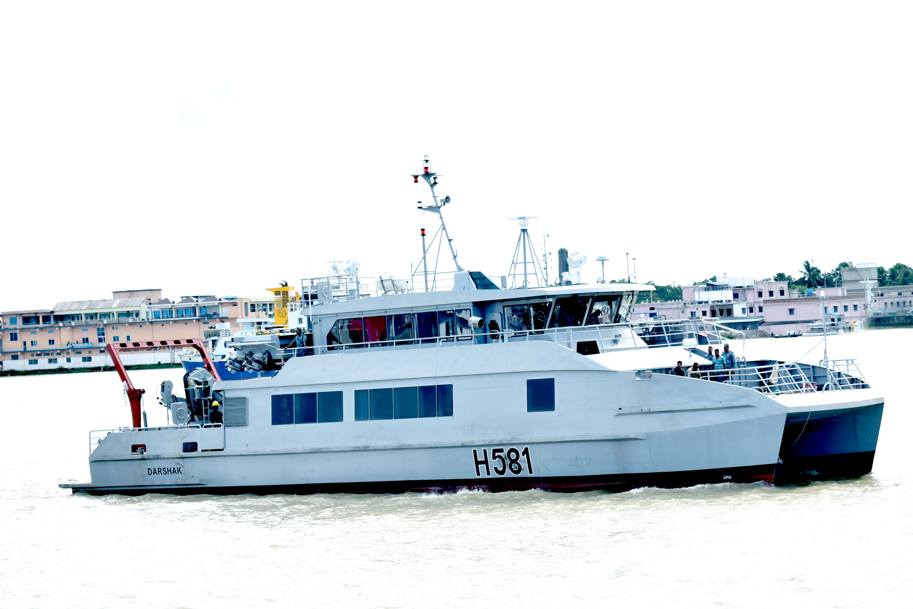

# 🌊 Hydrographic Research & Survey Vessel (HRSV)

  

<h2 align="center">02 × Hydrographic Research & Survey Vessel (HRSV)</h2>

<b>Bangladesh Navy (BN)</b> 
Senior Naval Architect | Structural Engineering | Production Design | Construction Support

---

## 📌 Project Summary

Successfully delivered **02 Aluminium Catamaran Hull Hydrographic Research & Survey Vessels** for the **Bangladesh Navy**. Designed for **day and night hydrographic surveying**, the vessels support seabed mapping, navigation safety, harbour development, and coastal hydrographic operations throughout Bangladesh.

My responsibilities included **structural engineering, detailed production design, engineering coordination, and construction support**, converting the approved basic design into production-ready drawings while ensuring compliance with contractual requirements, aluminium shipbuilding standards, and project quality objectives.

| **Client** | Bangladesh Navy (BN) |
|:-----------|:---------------------|
| **Vessel Type** | Hydrographic Research & Survey Vessel |
| **Quantity** | 02 Vessels |
| **Hull Type** | Aluminium Catamaran |
| **Material** | Aluminium Alloy 5083 |
| **Role** | Senior Naval Architect |
| **Scope** | Structural Engineering • Production Design • Engineering Coordination • Construction Support |
| **Delivery** | 2019 |

---

## 📐 Principal Particulars

| Parameter | Value |
|:----------|------:|
| Hull Type | **Catamaran** |
| Material | **Aluminium Alloy 5083** |
| Length Overall (LOA) | **30.98 m** |
| Breadth (Max) | **8.40 m** |
| Maximum Draft | **1.65 m** |
| Maximum Speed | **12 knots** |

---

## 👨‍💼 Engineering Contributions

- Developed detailed hull structural and production drawings from the approved basic design.
- Prepared fabrication-ready structural documentation for aluminium hull construction.
- Coordinated structural engineering activities with machinery, outfitting, piping, electrical, and production teams.
- Reviewed production drawings to ensure constructability, fabrication efficiency, and compliance with project specifications.
- Resolved structural and production-related technical issues throughout construction.
- Supported workshop production, block assembly, inspections, harbour acceptance tests, sea trials, and final delivery.
- Coordinated engineering changes, drawing revisions, and technical documentation during construction.
- Worked closely with shipyard production personnel, client representatives, and project stakeholders to achieve successful project completion.

---

## ⭐ Technical Expertise Demonstrated

**Aluminium Ship Structures • Catamaran Structural Design • Detailed Structural Engineering • Production Design • Fabrication Drawings • Engineering Coordination • Construction Support • Technical Documentation • Production Engineering • Harbour Acceptance Tests • Sea Trials**

---

## 💻 Engineering Software

**AVEVA Marine • AutoCAD • Rhino3D • Maxsurf • ANSYS**

---

## 📬 Contact

**Md. Ariful Islam**

**Senior Naval Architect | Ship Design | Structural Engineering | Production Engineering | Design Management | Classification Compliance**

📧 ariful.buet1985@gmail.com

💼 https://linkedin.com/in/islam-mdariful
